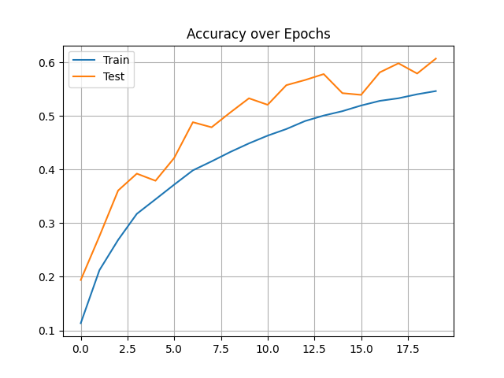
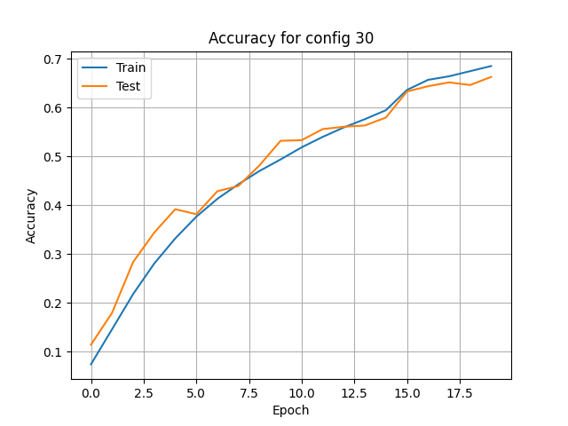
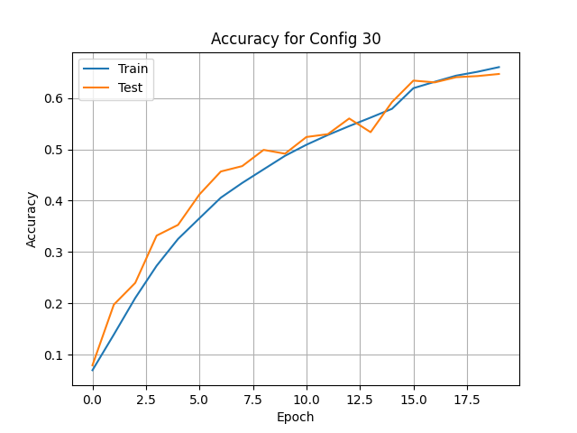
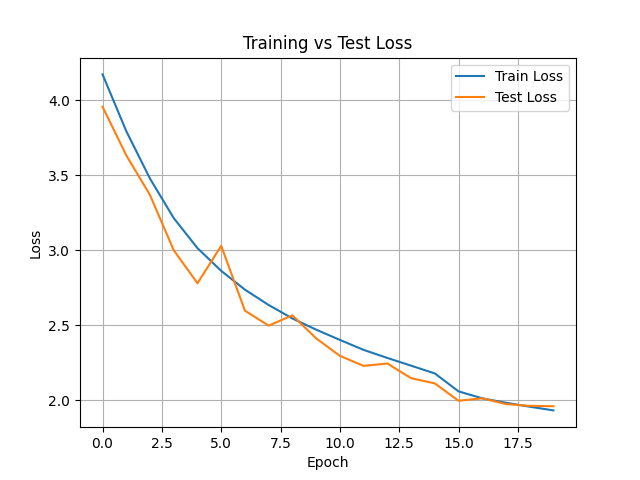
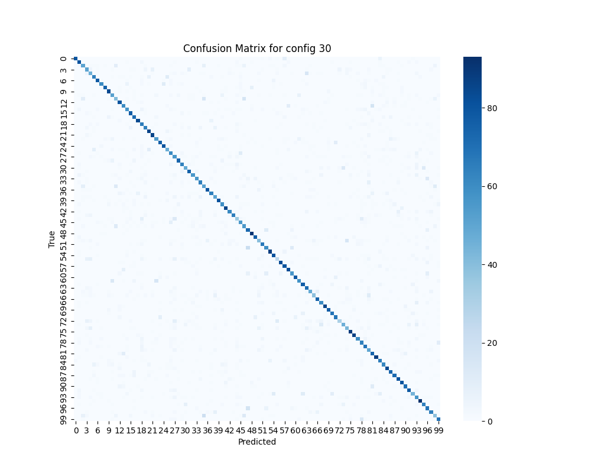

# Assignment #1 Report

## Introduction
The CIFAR-100 dataset has 100 classes each containing 600 sample images, making image classification harder. This assignment looks into varying loss functions, optimizers, learning rates, data augmentation, ResNet-based architectures, and how these impact classification performance. ResNet was chosen to minimize vanishing gradients by creating shortcut connections.

## Dataset
The CIFAR-100 dataset is used which consists of 60,000 sample images. Data augmentation techniques like random cropping, horizontal flipping, color jitter, random erasing, and random rotation were applied to improve generalization.

## Methods
A ResNet-based architecture was implemented in PyTorch, using residual blocks and batch normalization. The experiment used 20 combinations of these hyperparameters:
* Loss functions: **CrossEntropy**, **LabelSmoothing**
* Optimizers: **Adam**, **SGD**, **RMSprop**
* Learning Rates: **0.01**,   **0.001**,  
 **0.0005**

 Each config used **10** epochs on an **``RTX 3080``** for training.

## Experiments
Many model architectures were used, but each config used the same preprocessing pipeline. The biggest focus was on the loss function, optimizer, and learning rate. Accuracy was recoreded at each epoch. Learning rate decay was not applied to show the effect of the base learning rate.

## Results
* Accuracy and loss over epochs were plotted for each config.
* A JSON file captured max test accuracy for each config.
* The best accuracy observed: **~67.898%**

**Best Accuracy Run**

##### Same Config
**2nd Best Accuracy** 

**Loss Plot**

**Confusion Matrix**

**Correct Classifications**

**Incorrect Classifications**

## Future Work
Label smoothing consistently improved the generalization and performed even better with the Adam optimizer. Higher Learning rates usually underperformed in early epochs.
Future versions could include:
* Learning rate schedules
* Different network depths
* Advanced optimizers like AdamW or Lookahead

## References
[PyTorch Classification Tutorial](https://docs.pytorch.org/tutorials/beginner/blitz/cifar10_tutorial.html)  
[Writing ResNet from Scratch in PyTorch](https://www.digitalocean.com/community/tutorials/writing-resnet-from-scratch-in-pytorch)  
[Data Augmentation Techniques (TorchVision)](https://docs.pytorch.org/vision/stable/transforms.html)  
[Deep Residual Learning for Image Recognition (He et al., 2016)](https://www.cv-foundation.org/openaccess/content_cvpr_2016/papers/He_Deep_Residual_Learning_CVPR_2016_paper.pdf)
